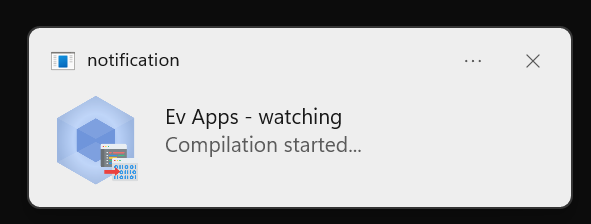
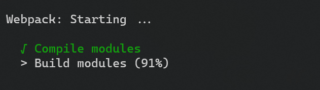
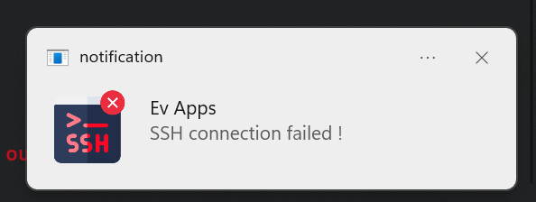
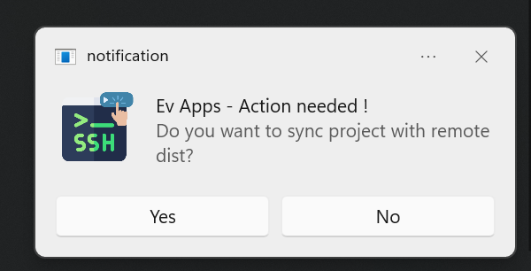
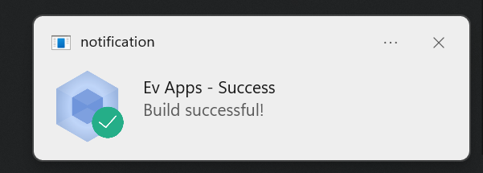

# webpack-deploy-sync

A [Webpack](https://webpack.github.io/) plugin that that makes it easier to deploy bundles to remote machines and display OS-level notifications for Webpack build and ssh actions events.

## Install

```bash
npm install webpack-deploy-sync-plugin --save-dev
```

Or

```bash
yarn add webpack-deploy-sync-plugin --dev
```

## Purpose

<p align="center">
  
</p>

<p align="center">
  
</p>

<p align="center">
  
</p>

<p align="center">
  
</p>

<p align="center">
  
</p>


## Usage

To use, install the webpack-deploy-sync-plugin package `npm install webpack-deploy-sync-plugin --save-dev` and add the plugin to your [Webpack configuration file](https://webpack.github.io/docs/configuration.html):

```javascript
// webpack.config.js
const WebpackDeploySyncPlugin = require('webpack-deploy-sync-plugin');
// SSH configuration
const sshConfig = {
  host:'my.remote.host.com',
  port: 22,
  username:'johnDoe',
  password: 'securepassword',
};
// remote output path
const remoteOutput = '/var/www/my_project/dist';

module.exports = {
  // ... snip ...
  plugins: [
    new WebpackDeploySyncPlugin({
      title: 'My Awsome Project',
      webpackInstance: webpack,
      sshConfig,
      remoteOutput
    })
  ],
  // ... snip ...
}
```


TypeScript
----------
This project is written in TypeScript, and type declarations are included. You can take advantage of this if your project's webpack configuration is also using TypeScript (e.g. `webpack.config.ts`).

```typescript
// webpack.config.ts
import * as webpack from 'webpack'
import * as WebpackDeploySyncPlugin from 'webpack-deploy-sync-plugin';
// SSH configuration
const sshConfig = {
  host:'my.remote.host.com',
  port: 22,
  username:'johnDoe',
  password: 'securepassword',
};
// remote output path
const remoteOutput = '/var/www/my_project/dist';
// Webpack configuration
const config: webpack.Configuration = {
  // ... snip ...
  plugins: [
    new WebpackDeploySyncPlugin({
      title: 'My Awsome Project',
      webpackInstance: webpack,
      sshConfig,
      remoteOutput
    })
  ],
  // ... snip ...
};
export default config;
```

Notes
-----


